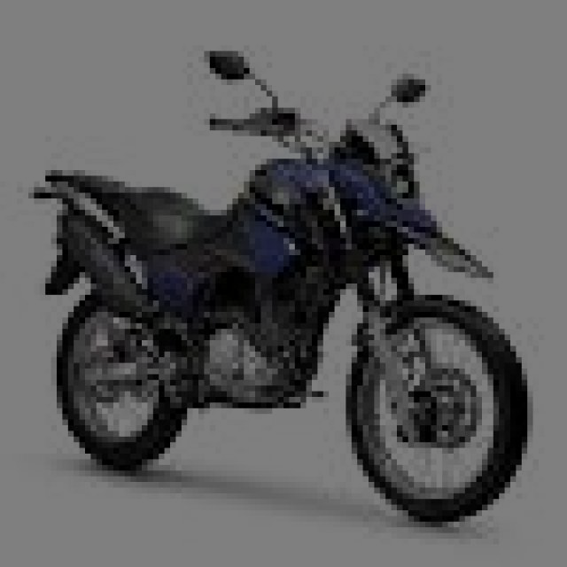
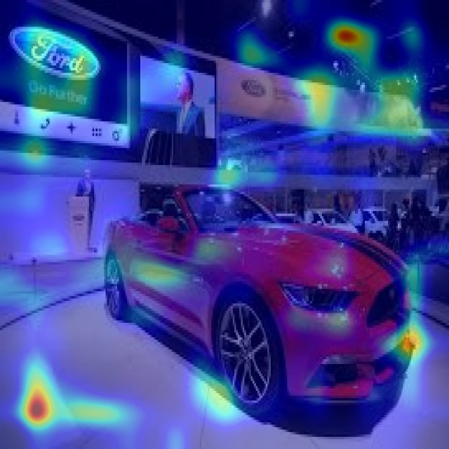

# Transfer Learning for Classification with Top Ten TorchVision Models


<table>
  <tr>
    <th>Original Picture</th>
    <th>Convnext</th>
    <th>Densenet</th>
    <th>Googlenet</th>
    <th>Mobilenetv3</th>
    <th>Mnasnet</th>
    <th>SwinTransformer</th>
    <th>Shufflenet</th>
    <th>WideRes</th>
    <th>Efficientnet</th>
  </tr>
  <tr>
    <td></td>
    <td></td>
    <td></td>
    <td></td>
    <td></td>
    <td></td>
    <td></td>
    <td></td>
    <td></td>
    <td></td>
  </tr>
  <tr>
    <td></td>
    <td></td>
    <td></td>
    <td></td>
    <td></td>
    <td></td>
    <td></td>
    <td></td>
    <td></td>
    <td></td>
  </tr>
  <tr>
    <td></td>
    <td></td>
    <td></td>
    <td></td>
    <td></td>
    <td></td>
    <td></td>
    <td></td>
    <td></td>
    <td></td>
  </tr>
</table>


## Table of Contents
- [Transfer Learning for Classification with Top Ten TorchVision Models](#transfer-learning-for-classification-with-top-ten-torchvision-models)
  - [Table of Contents](#table-of-contents)
  - [Transfer Learning](#transfer-learning)
    - [Introduction](#introduction)
    - [Methodology](#methodology)
      - [Model Performance Comparison](#model-performance-comparison)
      - [Convnext](#convnext)
      - [Densenet](#densenet)
      - [Efficientnet](#efficientnet)
      - [Googlenet](#googlenet)
      - [Mobilenetv3](#mobilenetv3)
      - [Mnasnet](#mnasnet)
      - [SwinTransformer](#swintransformer)
      - [Shufflenet](#shufflenet)
      - [VisionTransformer](#visiontransformer)
      - [WideRes](#wideres)
  - [GradCam](#gradcam)
      - [GradCam on Densenet](#gradcam-on-densenet)
  
## Transfer Learning

Transfer learning **leverages** the knowledge gained by deep learning models through training on massive and diverse datasets. Instead of training a model from scratch, we start with a pre-trained model, typically on a large dataset like ImageNet, which has learned general features, patterns, and representations. Then, we fine-tune this model on our smaller, task-specific dataset to adapt it to our unique classification problem. This approach **saves time, computational resources, and often yields superior results**.

--------

### Introduction

In this project, we address a common challenge in transfer learning: adapting pre-trained models to match our specific classification classes. Our objective is to classify images into three classes: "moto," "car," and "camino." To achieve this, we have chosen to leverage the power of transfer learning using ten popular TorchVision models. These models are pre-trained on large datasets and have demonstrated impressive performance on a wide range of computer vision tasks.

### Methodology

To adapt the pre-trained models for our classification task, we followed a standardized approach:

**Model Selection:** We selected ten popular TorchVision models known for their strong performance in various computer vision tasks. These models include ResNet, VGG, Inception, and others.

**Dataset Preparation:** Our dataset contains images of "moto," "car," and "camino." We ensured that the dataset was well-structured and labeled with the appropriate class labels.

**Training Configuration:** We trained each selected model using the following common hyperparameters:

- Number of Epochs: 20
- Learning Rate: 0.05
- Loss Function: CrossEntropyLoss
- Optimizer: Adam

**Learning Rate Scheduler:** To improve convergence and avoid overshooting, we employed a learning rate scheduler - `optim.lr_scheduler.ReduceLROnPlateau`. This scheduler dynamically adjusted the learning rate based on the model's performance, with parameters set as `factor = 0.2` and `patience = 10`.


#### Model Performance Comparison


| Model          | Accuracy in Train | Accuracy in Test | Confusion Matrix | Accuracy in TensorBoard |
|----------------|-------------------|------------------|------------------|-------------------------|
| [Convnext](#convnext) | 99.81             | 98.46            |  |  |
| [Densenet](#densenet) | 97.1              | 86.05            |  |  |
| [Googlenet](#googlenet) | 93.28             | 74.26            |  |  |
| [Mobilenetv3](#mobilenetv3) | 91.47             | 46.74            |  |  |
| [Mnasnet](#mnasnet) | 91.87             | 74.28            |  |  |
| [SwinTransformer](#swintransformer)| 96.45             | 99.58            |  |  |
| [Shufflenet](#shufflenet) | 94.81             | 74.32            |  |  |
| [VisionTransformer](#visiontransformer) | 99.97           | 97.73            |  |  |
| [WideRes](#wideres) | 47.17             | 25.11            |  |  |
| [Efficientnet](#efficientnet) | 91.92             | 57.57            |  |  |


--------

#### Convnext

```bash

class Convnext(nn.Module):
    def __init__(self, num_classes=3):
        super(Convnext, self).__init__()
        #https://pytorch.org/vision/main/models/convnext.html
        self.convnext = models.convnext_tiny(pretrained = True)
        
        # for param in self.convnext.parameters():
        #     param.requires_grad = False
                
        
        self.convnext.classifier[-1] = nn.Linear(self.convnext.classifier[-1].in_features, num_classes)
    
    def forward(self, x):
        return self.convnext(x)

        
```
[Back to Table](#model-performance-comparison)


--------


#### Densenet

```bash

class Densenet(nn.Module):
    def __init__(self, num_classes=3):
        super(Densenet, self).__init__()
        #https://pytorch.org/vision/main/models/densenet.html
        self.densenet = models.densenet161(weights = DenseNet161_Weights.IMAGENET1K_V1)
        
        # for param in self.densenet.parameters():
        #     param.requires_grad = False
                
        
        self.densenet.classifier = nn.Linear(self.densenet.classifier.in_features, num_classes)
    
    def forward(self, x):
        return self.densenet(x)
```

[Back to Table](#model-performance-comparison)


--------

#### Efficientnet

```bash

class Efficientnet(nn.Module):
    def __init__(self, num_classes=3):
        super(Efficientnet, self).__init__()
        #https://pytorch.org/vision/stable/models/efficientnet.html
        self.efficientnet = models.efficientnet_b0(weights='IMAGENET1K_V1')
        
        # for param in self.efficientnet.parameters():
        #     param.requires_grad = False
                
        
        self.efficientnet.classifier[-1] = nn.Linear(self.efficientnet.classifier[-1].in_features, num_classes)
    
    def forward(self, x):
        return self.efficientnet(x)
```


[Back to Table](#model-performance-comparison)

--------

#### Googlenet

```bash

class Googlenet(nn.Module):
    def __init__(self, num_classes=3):
        super(Googlenet, self).__init__()
        #https://pytorch.org/vision/stable/models/googlenet.html
        self.googlenet = models.googlenet(weights='IMAGENET1K_V1')
        
        # for param in self.googlenet.parameters():
        #     param.requires_grad = False
                
        
        self.googlenet.fc = nn.Linear(self.googlenet.fc.in_features, num_classes)
    
    def forward(self, x):
        if self.training:        
            return self.googlenet(x)
        else : 
            return self.googlenet(x)

```


[Back to Table](#model-performance-comparison)


--------

#### Mobilenetv3


```bash
class Mobilenetv3(nn.Module):
    def __init__(self, num_classes=3):
        super(Mobilenetv3, self).__init__()
        #https://pytorch.org/vision/main/models/mobilenetv3.html
        self.mobilenetv3 = models.mobilenet_v3_small(weights='IMAGENET1K_V1')
        
        # for param in self.mobilenetv3.parameters():
        #     param.requires_grad = False
                
        
        self.mobilenetv3.classifier[-1] = nn.Linear(self.mobilenetv3.classifier[-1].in_features, num_classes)
    
    def forward(self, x):
        return self.mobilenetv3(x)
```


[Back to Table](#model-performance-comparison)


--------

#### Mnasnet


```bash

class Mnasnet(nn.Module):
    def __init__(self, num_classes=3):
        super(Mnasnet, self).__init__()
        # https://pytorch.org/vision/main/models/mnasnet.html
        self.mnasnet = models.mnasnet0_75(weights='IMAGENET1K_V1')
        
        # for param in self.mnasnet.parameters():
        #     param.requires_grad = False
                
        
        self.mnasnet.classifier[-1] = nn.Linear(self.mnasnet.classifier[-1].in_features, num_classes)
    
    def forward(self, x):
        return self.mnasnet(x)
```


[Back to Table](#model-performance-comparison)


--------
#### SwinTransformer

```bash
class SwinTransformer(nn.Module):
    def __init__(self, num_classes=3):
        super(SwinTransformer, self).__init__()
        # https://pytorch.org/vision/stable/models/swin_transformer.html
        self.swin = models.swin_t(weights='IMAGENET1K_V1')
        
        # for param in self.swin.parameters():
        #     param.requires_grad = False
                
        
        self.swin.head = nn.Linear(self.swin.head.in_features, num_classes)
    
    def forward(self, x):
        return self.swin(x)

```


[Back to Table](#model-performance-comparison)


--------
#### Shufflenet


```bash
class Shufflenet(nn.Module):
    def __init__(self, num_classes=3):
        super(Shufflenet, self).__init__()
        # https://pytorch.org/vision/stable/models/shufflenetv2.html
        self.shufflenet = models.shufflenet_v2_x2_0(weights='IMAGENET1K_V1')
        
        # for param in self.shufflenet.parameters():
        #     param.requires_grad = False
                
        
        self.shufflenet.fc = nn.Linear(self.shufflenet.fc.in_features, num_classes)
    
    def forward(self, x):
        return self.shufflenet(x)
```


[Back to Table](#model-performance-comparison)

--------
#### VisionTransformer


```bash
class VisionTransformer(nn.Module):
    def __init__(self, num_classes=3):
        super(VisionTransformer, self).__init__()
        # https://pytorch.org/vision/stable/models/vision_transformer.html
        self.vit = models.vit_b_16(weights='IMAGENET1K_V1')
        
        # for param in self.vit.parameters():
        #     param.requires_grad = False
                
        
        self.vit.heads.head = nn.Linear(self.vit.heads.head.in_features, num_classes)
    
    def forward(self, x):
        return self.vit(x)
```
[Back to Table](#model-performance-comparison)

--------

#### WideRes

```bash
class WideRes(nn.Module):
    def __init__(self, num_classes=3):
        super(WideRes, self).__init__()
        # https://pytorch.org/vision/stable/models/wide_resnet.html
        self.wide_res = models.wide_resnet50_2(weights=None)
        
        # for param in self.wide_res.parameters():
        #     param.requires_grad = False
                
        
        self.wide_res.fc = nn.Linear(self.wide_res.fc.in_features, num_classes)
    
    def forward(self, x):
        return self.wide_res(x)
```

--------

## GradCam

**Grad-CAM (Gradient-weighted Class Activation Mapping)** is a visualization technique used to **interpret and understand Convolutional Neural Networks (CNNs)** by **highlighting which regions of an input image are most influential in making predictions**. It helps answer the question: "What does the model look at when making a decision?"

Grad-CAM works by **computing the gradients of the predicted class score with respect to the feature maps produced by the last convolutional layer** of the network. These gradients are then used to **generate a heatmap** that **indicates the importance of different regions of the input image**. In essence, Grad-CAM reveals which parts of the image were "activated" during the decision-making process, **providing valuable insights into the model's behavior**.

#### GradCam on Densenet

We conducted a comprehensive Grad-CAM analysis on the Densenet model. Our goal was to visualize what the model pays attention to at different layers, from the initial layers to the final layers. We have generated and provided visual representations to simplify and clarify the insights gained from this analysis.

As shown in the table above, we present the Grad-CAM visualizations for the initial layers of the Densenet model. These layers focus on **detecting low-level features** such as edges, corners, and textures. The regions highlighted in the image show where the model pays the most attention when identifying basic visual patterns in the input images. Moving deeper into the network, the Grad-CAM visualizations for intermediate layers highlight **more abstract features**. These layers capture complex patterns and shapes, gradually building a hierarchical representation of the input data. The areas emphasized in this image reveal what the model considers essential for classifying the images into "moto," "car," or "camino."

In the final layers of Densenet, the Grad-CAM analysis focuses on **high-level features critical for making classification decisions**. These layers consolidate the learned representations and make predictions based on the information gathered throughout the network. The regions of interest in this image depict where the model concentrates its attention when making the ultimate choice between the three classes.

The Grad-CAM visualizations for Densenet provide a clear and intuitive understanding of how the model processes information at different layers. From identifying basic visual elements in the initial layers to recognizing abstract and complex features in the intermediate layers, and finally, to making high-level decisions in the final layers, this analysis offers valuable insights into the inner workings of the model.


| Original Picture | First Layer | Second Layer | Third Layer | Last Layer |
|------------------|-------------|--------------|------------|------------|
|  |  |  |  |  |
|  |  |  |  |  |
|  |  |  |  |  |


